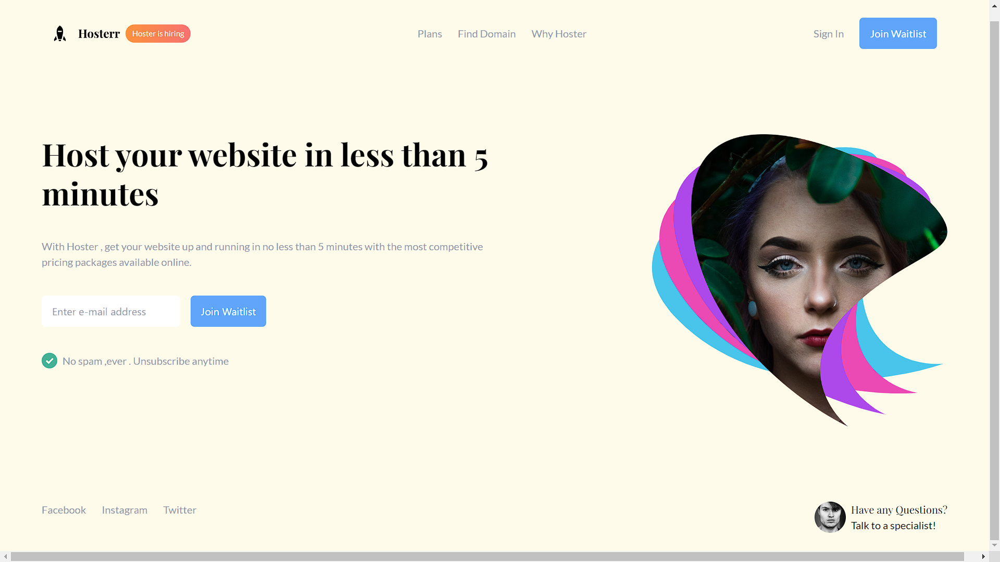

# Vite + React Project

This is a simple Vite + React application. The layout is minimalistic and functional, featuring basic components such as a header, footer, and a central content area. It serves as a straightforward demo or template site.

## Preview

[](https://hostmysite.netlify.app/)

## Getting Started

### Prerequisites

Make sure you have the following installed:

- Node.js
- npm or yarn

### Installation

1. Clone the repository:

    ```sh
    git clone https://github.com/yourusername/yourrepository.git
    ```

2. Navigate to the project directory:

    ```sh
    cd yourrepository
    ```

3. Install the dependencies:

    ```sh
    npm install
    # or
    yarn install
    ```

### Running the Project

Start the development server:

```sh
npm run dev
# or
yarn dev
